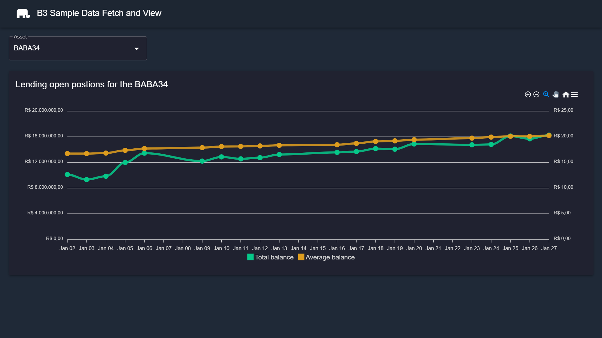

# Sample B3 Assets Data Fetch and View

This project was made to explore many Laravel and Vue functionalities. The system can fetch some public data from B3 stock exchange and provides an API to query the data and a simple front end to see a chart example with this data.

## Getting Started

To use and test it you can follow the steps explained inside "front" and "api" folders.

## Technologies and tools
  
 
  

## Explored concepts
Laravel:
* Jobs
* Commands
* Unit tests
* Factories
* Model relationships
* Error handling
* FormRequest
